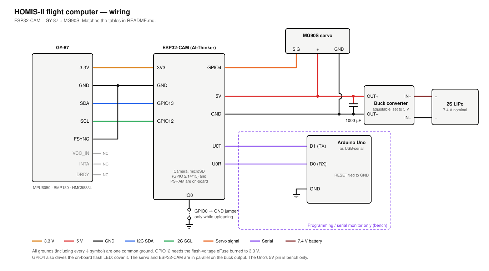

# HOMIS-II flight computer

ESP32-CAM + GY-87 + MG90S. Estimates altitude and vertical velocity, detects
apogee and turns the servo from **lock** to **release** to eject the parachute.
No extra libraries.

**Status:** see [`../README.md`](../README.md). It runs on the board and has
passed an indoor stair test. Not flight-ready.

## Files

| File | What |
|---|---|
| `FlightComputer.ino` | Sensors, servo, SD, camera, Wi-Fi, tasks |
| `FlightLogic.h` | Estimator + state machine. Plain C++, no hardware |
| `WebPage.h` | Pre-launch page |
| `../FlightSim/flight_sim.cpp` | Runs `FlightLogic.h` against simulated flights |

## Wiring



**GY-87 → ESP32-CAM**

| GY-87 pin | Connects to | Notes |
|---|---|---|
| 3.3V | **3V3** | |
| GND | **GND** | |
| SDA | **GPIO13** | |
| SCL | **GPIO12** | Needs the eFuse fix below |
| FSYNC | **GND** | The MPU6050 datasheet says to ground it when unused |
| VCC_IN | not connected | Would put 5 V on the I2C pull-ups |
| INTA, DRDY | not connected | Sensors are polled, not interrupt-driven |

**Power**

Two LiPo cells in series (2S, 7.4 V nominal) feed an adjustable buck converter
set to 5 V. A 1000 µF capacitor sits directly across its OUT+/OUT−, and from
there the output branches in parallel to the ESP32-CAM (5V/GND) and the servo.
The capacitor helps stop a servo stall from browning out the ESP32.

**MG90S servo**

| Servo wire | Connects to | Notes |
|---|---|---|
| Red (+) | Buck converter **5 V** out | In parallel with the ESP32-CAM's 5V. Not from the ESP32-CAM's pins or the Uno |
| Brown (GND) | Buck converter GND out **and** ESP32-CAM GND | Grounds must be joined or the servo can't read the signal |
| Orange (signal) | **GPIO4** | 3.3 V logic is enough for the MG90S |

**Arduino Uno as USB-to-serial programmer**

| Uno | Connects to | Notes |
|---|---|---|
| 5V | ESP32-CAM **5V** | Bench only. Use the buck converter for real runs |
| GND | ESP32-CAM **GND** | |
| D0 (RX) | ESP32-CAM **U0R** | Direct |
| D1 (TX) | ESP32-CAM **U0T** | Direct |
| RESET | Uno **GND** | Holds the Uno's own chip in reset so it just passes data through |
| — | ESP32-CAM **GPIO0 (IO0) → GND** | **Only while uploading.** Remove it and press reset to run |

All grounds are joined: Uno, ESP32-CAM, GY-87 (GND and FSYNC), servo and buck converter.

### Pin map

| GPIO | Used by |
|---|---|
| 0, 5, 18, 19, 21, 22, 23, 25, 26, 27, 32, 34, 35, 36, 39 | Camera (on the board). Its control bus is on 26/27, I2C port 1 |
| 16 | PSRAM (on the board). Never use |
| 2, 14, 15 | microSD, 1-bit mode |
| 13 / 12 | GY-87 SDA / SCL (I2C port 0) |
| 4 | Flash LED **and** servo signal (LEDC timer 1; the camera clock owns timer 0) |
| 1, 3 | Serial (upload and monitor) |

No spare pins are left. Anything else has to go on the I2C bus (in use: 0x68
MPU6050, 0x77 BMP180, 0x1E HMC5883L), e.g. a PCA9685 servo board at 0x40.

## Building and uploading

| Arduino IDE setting | Value |
|---|---|
| Board package | esp32 by Espressif (3.x) |
| Board | AI Thinker ESP32-CAM |
| **CPU Frequency** | **240 MHz** (lower makes the SD card fail with `0x107`) |
| Partition scheme | Huge APP (3MB No OTA) |
| PSRAM | Enabled (if shown) |
| Upload speed / serial monitor | 115200 |

To upload: connect GPIO0 (IO0) to GND, press reset, click Upload, then remove the IO0
wire and press reset again.

### Problems we hit

| Problem | Cause | Fix |
|---|---|---|
| Board won't start with the GY-87 connected | GPIO12 is a strapping pin. The GY-87's SCL pull-up holds it high, which selects 1.8 V flash | Burn the flash-voltage eFuse once: `espefuse --port COMx set-flash-voltage 3.3V` (`pip install esptool`). Permanent, safe on AI-Thinker boards |
| `sdmmc_host_reset returned 0x107` / SD mount fails | CPU below 240 MHz, or LEDC started before the SD host | 240 MHz, and start the SD card before the camera (the firmware does) |
| Compile clash with the Adafruit sensor libraries | `Adafruit_Sensor.h` and `esp_camera.h` both define `sensor_t` | The firmware has its own MPU6050 and BMP180 drivers |
| Random `POWERON_RESET` at start-up | Supply dips when powered through the Uno's 5V pin | Power from the buck converter |

## How velocity is estimated

1. **Attitude.** On the pad, gravity gives the board's orientation, so mounting
   direction does not matter. After launch the gyro is integrated, so the accel
   is projected onto the true vertical even as the rocket tilts.
2. **Vertical acceleration** = accel rotated to the world frame, minus the 1 g
   the board measured at rest (this cancels accelerometer scale error).
3. **Kalman filter** with states altitude, velocity and accel bias. Accel drives
   the prediction at 100 Hz, and the baro (50 Hz) corrects it. When the accel
   clips at 16 g, the filter trusts the baro more. If the IMU stops responding,
   it runs on the baro alone.

## When it deploys

`SAFE → CALIBRATING → ARMED → BOOST → COAST → DESCENT → LANDED`

| Trigger | Condition |
|---|---|
| Launch | \|accel\| > 2.5 g for 50 ms, or baro > 20 m above the pad |
| Burnout | net vertical accel < 0 for 100 ms |
| **Deploy: velocity** (primary) | in COAST, T+ ≥ 1.5 s, filtered velocity < 0 for 100 ms |
| Deploy: baro (backup) | baro altitude 5 m below its maximum |
| Deploy: timer (backup) | T+ ≥ the backup timer set on the page |
| False launch | a "launch" that stays under 5 m for 3 s goes back to ARMED |
| Landed | \|v\| < 1 m/s for 5 s |

All deploys require launch to have been detected. Every threshold is a default
in `fl::Tuning` in `FlightLogic.h`. None of them comes from a flight test, so
check them against the OpenRocket sim for this rocket.

## Wi-Fi pre-launch page

Join **`HOMIS2-AVIONICS`**, password `isra-m003` (change `AP_PASS`), and open
**http://192.168.4.1**.

- **Checks:** MPU6050 and BMP180 detected *and* producing changing readings,
  accel reads 1 g at rest, SD card, camera, servo position, backup timer, log drops.
- **Live:** filtered and raw altitude, velocity, vertical accel, gyro rate, pressure.
- **Servo test** and **settings** (backup timer, lock angle, release angle).
  These work only in SAFE and are saved on the board.
- **ARM** is refused unless the IMU and baro are reading, the SD card works, the
  backup timer is set and the servo is locked. Arming then calibrates for 2 s.
  The rocket must be still, or arming fails and says why.

Wi-Fi turns off at launch and comes back on after landing.

## Logs (`/run_NNN/` on the SD card)

- `flight.csv`: every 10 ms from ARM to landing, 10 Hz otherwise. Columns: `ms,state,p_Pa,temp_C,h_baro_m,h_m,v_ms,a_vert_ms2,acc_bias,ax,ay,az,gx,gy,gz,tilt_deg,sat`
- `events.csv`: boot, arm, launch, burnout, deploy (with reason), landing, resets
- `photos.csv` + `IMG_nnnnnn.jpg`: one photo per second, as before

## Reset during flight

The flight state lives in RTC memory, which survives a reset but not a power
cycle. After a brown-out or crash reset while ARMED or flying, the board resumes
where it was: the servo stays released if it already fired, and velocity comes
from the baro alone because the attitude is lost. The reset button and power-on
count as a normal boot.

## Before flying

1. **Power.** The servo and ESP32 share the buck converter's 5 V. Check the
   buck is set to 5 V before connecting the board, and that the 1000 µF
   capacitor is on its output.
2. **Flash LED.** It shares GPIO4 and glows with the servo pulses. Cover it.
3. **Servo angles.** On the page, set lock and release so that **Lock** holds
   the mechanism and **Release** ejects it. Pulse range: `SERVO_MIN_US` /
   `SERVO_MAX_US` (500–2400 µs for 0–180°). On power-up the servo goes to
   the lock angle, so set it before loading the parachute.
4. **Backup timer.** Set it to the OpenRocket apogee time plus about 2 s.
5. **Bench tests** (not yet done):
   - All checks OK on the page. Lock/Release move the mechanism the right way.
   - Arm and tap the board: no launch in `events.csv`.
   - Arm and swing the board hard in a circle (well over 2.5 g). It should
     detect launch, then log a false launch after 3 s and go back to ARMED.
   - Arm it inside a sealed jar, pump the pressure down, then let it back up.
     It should detect launch by baro, then deploy.
   - `logDrops` on the page stays 0 while photos are being saved.
6. **Simulate your rocket.** Put the OpenRocket mass, Cd·A and thrust in
   `Rocket` in `flight_sim.cpp` and run it (below).

## Simulator

```bash
cd ../FlightSim && c++ -std=c++17 -O2 -o flight_sim flight_sim.cpp && ./flight_sim
```

Results with the placeholder rocket (208 m apogee, 27 g spike that clips the
16 g accel, 5° rail tilt, board mounted sideways), 500 noisy runs per case:

| Case | Deploy − true apogee | Deployed by |
|---|---|---|
| All sensors | +0.11 s (sd 0.01, worst +0.14) | velocity |
| IMU dies at launch | +0.10 s (worst +0.12) | velocity (baro only) |
| Baro dies at launch | −0.42 s (worst −0.78) | velocity (accel only) |
| Reset at T+2 s | +0.11 s | velocity |
| Reset at T+5.5 s (1.5 s reboot) | +0.86 s | velocity, straight after reboot |
| 40 ms 5 g knock on the pad | never deploys | — |

The +0.1 s is the 100 ms confirmation window. The baro-dead case deploys early
because the 16 g clipping loses velocity during the spike.

## Known limits

- With the accelerometer saturated (> 16 g), velocity during that part comes
  from the baro, which is slower.
- The BMP180 sits inside the airframe. Vent holes and a bay sealed from the
  motor and parachute gases matter as much as the code.
- Single deployment only (no drogue/main split).
